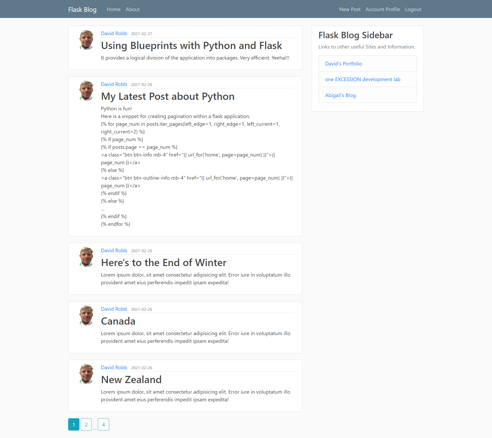

<!--
*** Thanks for checking out the Best-README-Template. If you have a suggestion
*** that would make this better, please fork the Flask_blog and create a pull request
*** or simply open an issue with the tag "enhancement".
*** Thanks again! Now go create something AMAZING! :D
***
***
***
*** To avoid retyping too much info. Do a search and replace for the following:
*** drobb2020, Flask_blog, DavidRobb2, email, Python Flask Blog, A basic blog application built with Python Flask from a series of tutorial videos on YouTube.
-->

<!-- PROJECT SHIELDS -->
<!--
*** I'm using markdown "reference style" links for readability.
*** Reference links are enclosed in brackets [ ] instead of parentheses ( ).
*** See the bottom of this document for the declaration of the reference variables
*** for contributors-url, forks-url, etc. This is an optional, concise syntax you may use.
*** https://www.markdownguide.org/basic-syntax/#reference-style-links
-->
[![Contributors][contributors-shield]][contributors-url]
[![Forks][forks-shield]][forks-url]
[![Stargazers][stars-shield]][stars-url]
[![Issues][issues-shield]][issues-url]
[![MIT License][license-shield]][license-url]
[![LinkedIn][linkedin-shield]][linkedin-url]

<!-- PROJECT LOGO -->
<br />
<p align="center">
  <a href="https://github.com/drobb2020/Flask_blog">
    
  </a>

  <h3 align="center">Python Flask Blog</h3>

  <p align="center">
    A basic blog application built with Python Flask from a series of tutorial videos on YouTube.
    <br />
    <a href="https://github.com/drobb2020/Flask_blog"><strong>Explore the docs »</strong></a>
    <br />
    <br />
    <a href="https://github.com/drobb2020/Flask_blog">View Demo</a>
    ·
    <a href="https://github.com/drobb2020/Flask_blog/issues">Flask_blog Bug</a>
    ·
    <a href="https://github.com/drobb2020/Flask_blog/issues">Request Feature</a>
  </p>
</p>

<!-- TABLE OF CONTENTS -->
<details open="open">
  <summary><h2 style="display: inline-block">Table of Contents</h2></summary>
  <ol>
    <li>
      <a href="#about-the-project">About The Project</a>
      <ul>
        <li><a href="#built-with">Built With</a></li>
      </ul>
    </li>
    <li>
      <a href="#getting-started">Getting Started</a>
      <ul>
        <li><a href="#prerequisites">Prerequisites</a></li>
        <li><a href="#installation">Installation</a></li>
      </ul>
    </li>
    <li><a href="#usage">Usage</a></li>
    <li><a href="#roadmap">Roadmap</a></li>
    <li><a href="#contributing">Contributing</a></li>
    <li><a href="#license">License</a></li>
    <li><a href="#contact">Contact</a></li>
    <li><a href="#acknowledgements">Acknowledgements</a></li>
  </ol>
</details>

<!-- ABOUT THE PROJECT -->
## About The Project



 A basic blog application built with Python Flask from a series of tutorial videos on YouTube.

### Built With

* [Python](https://python.org/)
* [Flask](https://flask.palletsprojects.com/en/2.0.x/)
* [SQLAlchemy](https://www.sqlalchemy.org/)

<!-- GETTING STARTED -->
## Getting Started

To get a local copy up and running follow these simple steps.

### Prerequisites

You will require Python and the packages listed in the requirements.txt file. Follow these steps to get setup.

### Installation

1. Clone the Flask_blog into the directory of your choice

    ```sh
    git clone https://github.com/drobb2020/Flask_blog.git
    ```

2. Create a virtual environment in the cloned directory

    ```sh
    python3 -m venv venv
    ```

3. Activate the virtual environment

    ```sh
    venv/Scripts/activate
    ```

4. Use pip to install all the project dependencies

    ```sh
    pip install -r requirements.txt
    ```

5. To run the Flask application

    ```sh
    python run.py
    ```

6. Launch a web browser and goto [localhost](http://127.0.0.1:5000)

<!-- USAGE EXAMPLES -->
## Usage

This is a project to teach myself the ins and outs of Flask and how to create a working web application. While this is fully functional I would not say that it is ready for production. There is a fair bit of functionality missing from the project for it to be production worthy.

_For more examples, please refer to the [Documentation](https://example.com)_

<!-- ROADMAP -->
## Roadmap

See the [open issues](https://github.com/drobb2020/Flask_blog/issues) for a list of proposed features (and known issues).

<!-- CONTRIBUTING -->
## Contributing

Contributions are what make the open source community such an amazing place to be learn, inspire, and create. Any contributions you make are **greatly appreciated**.

1. Fork the Project
2. Create your Feature Branch (`git checkout -b feature/AmazingFeature`)
3. Commit your Changes (`git commit -m 'Add some AmazingFeature'`)
4. Push to the Branch (`git push origin feature/AmazingFeature`)
5. Open a Pull Request

<!-- LICENSE -->
## License

Distributed under the MIT License. See `LICENSE` for more information.

<!-- CONTACT -->
## Contact

David Robb - [@DavidRobb2](https://twitter.com/DavidRobb2) - drobb2011@gmail.com

Project Link: [https://github.com/drobb2020/Flask_blog](https://github.com/drobb2020/Flask_blog)

<!-- ACKNOWLEDGEMENTS -->
## Acknowledgements

* [Corey Schafer](https://www.youtube.com/channel/UCCezIgC97PvUuR4_gbFUs5g)
* [YouTube Video Series](https://www.youtube.com/playlist?list=PL-osiE80TeTs4UjLw5MM6OjgkjFeUxCYH)

While Corey may not be posting new content right now his channel is still worth looking at if you are learning Python, Flask or Django.

Again this is a learning project for me.

<!-- MARKDOWN LINKS & IMAGES -->
<!-- https://www.markdownguide.org/basic-syntax/#reference-style-links -->
[contributors-shield]: https://img.shields.io/github/contributors/drobb2020/Flask_blog.svg?style=for-the-badge
[contributors-url]: https://github.com/drobb2020/Flask_blog/graphs/contributors
[forks-shield]: https://img.shields.io/github/forks/drobb2020/Flask_blog.svg?style=for-the-badge
[forks-url]: https://github.com/drobb2020/Flask_blog/network/members
[stars-shield]: https://img.shields.io/github/stars/drobb2020/Flask_blog.svg?style=for-the-badge
[stars-url]: https://github.com/drobb2020/Flask_blog/stargazers
[issues-shield]: https://img.shields.io/github/issues/drobb2020/Flask_blog.svg?style=for-the-badge
[issues-url]: https://github.com/drobb2020/Flask_blog/issues
[license-shield]: https://img.shields.io/github/license/drobb2020/Flask_blog.svg?style=for-the-badge
[license-url]: https://github.com/drobb2020/Flask_blog/blob/master/LICENSE.txt
[linkedin-shield]: https://img.shields.io/badge/-LinkedIn-black.svg?style=for-the-badge&logo=linkedin&colorB=555
[linkedin-url]: https://www.linkedin.com/in/david-robb-42436a20/
